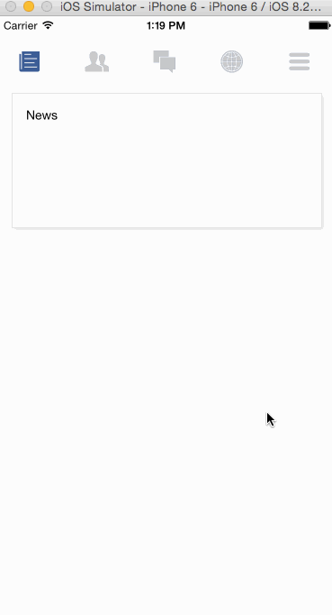

# 常用动画插件和自制动画组件

这里选择实现常用的tabBar插件
插件选择的是 react-native-scrollable-tab-view
[https://github.com/skv-headless/react-native-scrollable-tab-view](https://github.com/skv-headless/react-native-scrollable-tab-view)

