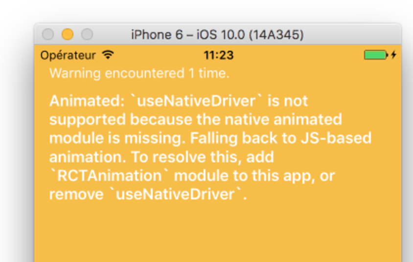
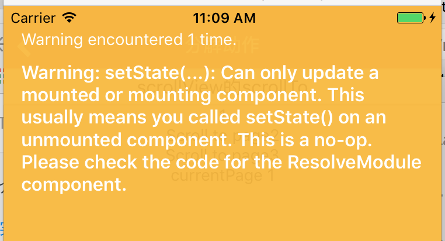

# 自定义时遇到的问题

## ReactNative-0.38,a warning,'useNativeDriver' is not supported

1. find RCTAnimation.xcodeproj from node_modules/react-native/NativeAnimation folder
2. open xcode
3. open project navigator (folder icon from the left)
4. drag & drop RCTAnimation.xcodeproj from the previous step to Libraries folder
5. Expand RCTAnimation.xcodeproj in project navigator and find libRCTAnimation.a file inside of Products folder
6. click on your project name on top of project navigator and go to Build Phrases tab
7. drag and drop libRCTAnimation.a to Link Binary With Libraries
8. Clean and run :)
[https://github.com/facebook/react-native/issues/11094](https://github.com/facebook/react-native/issues/11094)

----

## setState can only update a mounted or mounting component

